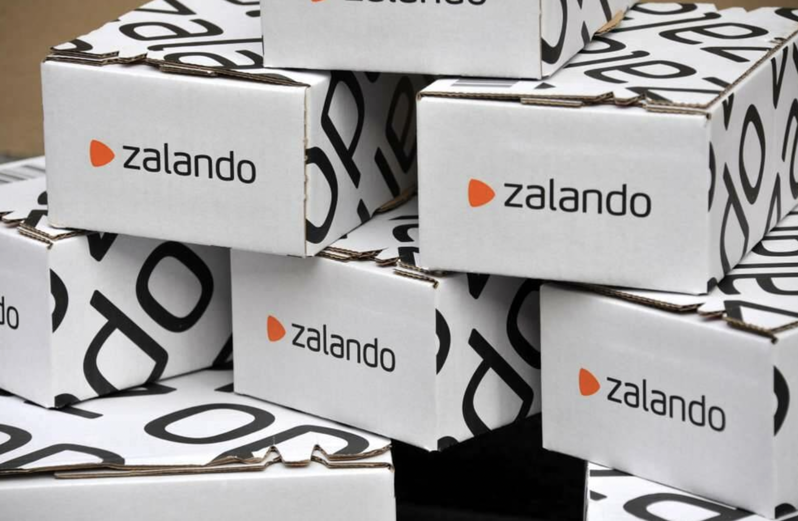

# Web Scraping Selenium Project

## 

### CONTEXT
#### For this project I had to simulate working in a company as a data analyst with the mission of getting information from a key competitor.
#### In my case, the company I work for is Foot Locker and I had used Selenium to get info from Zalando.
#
### WAYS OF WORKING
#### My mission was to get the brands and models of sneakers for women in Zalando as well as the prices of them, both original and promo prices.
#### To get all this info I have used Selenium, and then I have built Pandas dataframes to visualize the data, and finally some key graphs for my conclusions.
#### All the information is shown in 2 jupyter notebooks:
#### 1. Web Scraping Selenium: which shows how the data is gotten and then cleaned. 
#### 2. Report: showing all the conclusions and key info.
#
### LINKS AND RESOURCES
#### [Selenium](https://selenium-python.readthedocs.io/)

